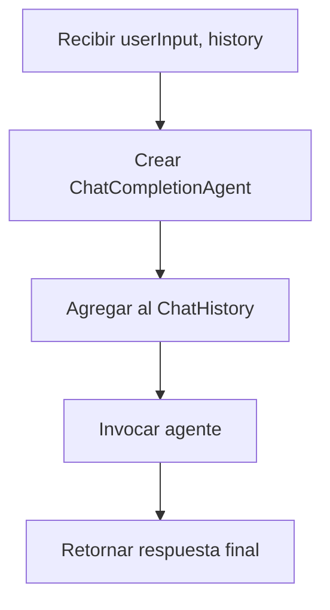
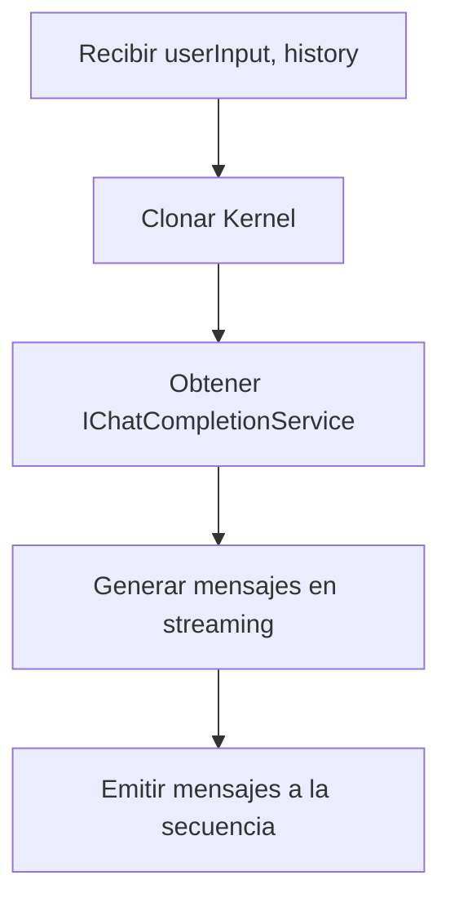
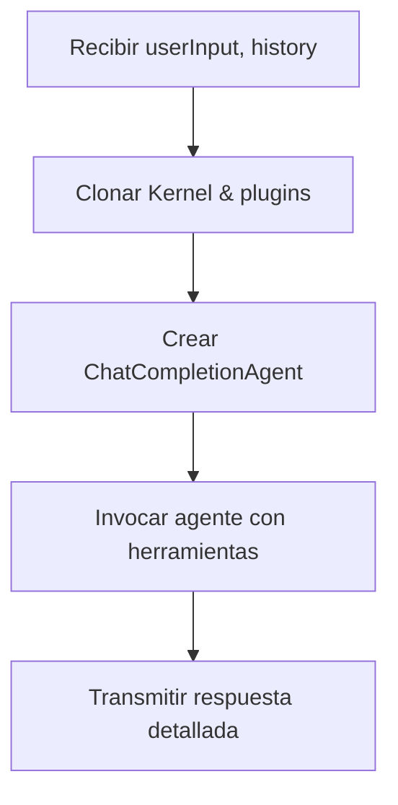
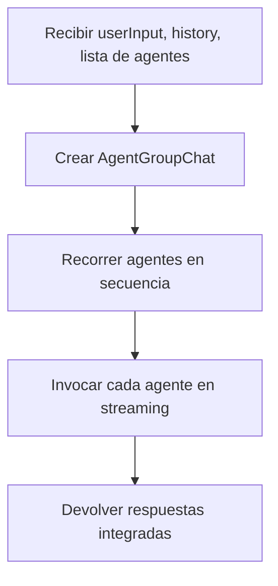
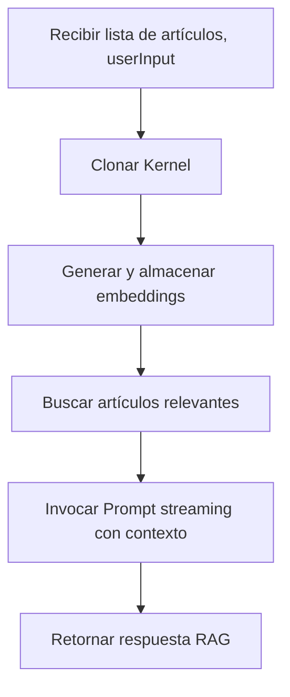
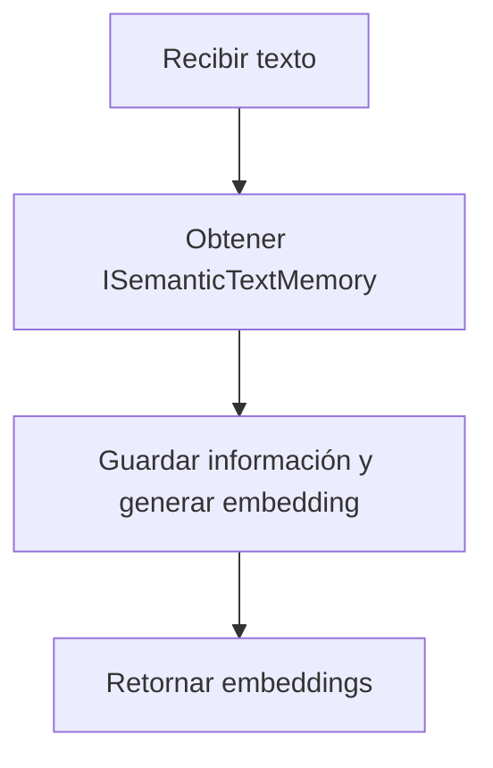
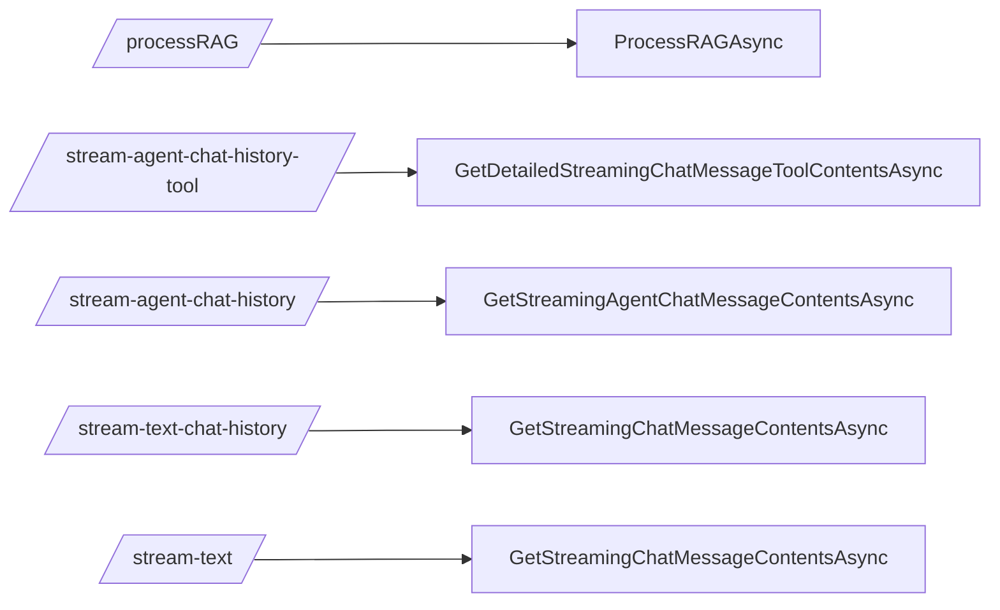

LICENSE
Copyright 2025 [Cristhian Fonseca -  cfonseca23]

Todos los derechos reservados. Este software no puede ser usado, modificado, copiado, distribuido ni publicado sin el permiso expreso del propietario.

## Configuración y uso
1. Ajustar parámetros de conexión en appsettings.json, por ejemplo:
   - OllamaConnectionString para la URL del servicio Ollama.
   - RedisConnection para la caché de Redis.
   - KernelOptions para la configuración del modelo, tamaño del vector, etc.

2. Revisar Program.cs, donde se inyectan los servicios:
   - builder.AddServiceDefaults() y builder.AddBrainKernel() para inicializar la aplicación.
   - Se registra KernelService para su uso en controladores o endpoints.

3. Consultar KernelService.cs para ver la lógica principal del asistente, manejo de ChatHistory, uso de agentes y métodos de streaming.

## Endpoints
1. **POST /processRAG**  
   Procesa artículos y genera respuestas con RAG (Retrieval-Augmented Generation).

2. **POST /stream-agent-chat-history-tool**  
   Transmite el contenido de chat detallado con herramientas, útil para obtener metadatos adicionales.

3. **POST /stream-agent-chat-history**  
   Maneja múltiples agentes (Jarvis, CopilotJarvis, etc.) y envía mensajes de manera progresiva.

4. **POST /stream-text-chat-history**  
   Retorna mensajes de chat en streaming, mostrando metadatos y contenido en tiempo real.

5. **POST /stream-text**  
   Envía respuesta textual de forma continua, ideal para manejar respuestas extensas en partes.

## Diagramas Mermaid

### GetChatCompletionResponseAsync

### GetStreamingChatMessageContentsAsync

### GetDetailedStreamingChatMessageToolContentsAsync

### GetStreamingAgentChatMessageContentsAsync

### ProcessRAGAsync

### CreateTextEmbeddingAsync

## Relación de Endpoints y Métodos

## Observaciones de appsettings
- "ConnectionStrings" contiene cadenas de conexión para Ollama, Redis y Qdrant.
- "KernelOptions" define la configuración del modelo de chat y embeddings.
- Ajustar estos valores para apuntar a los servicios correctos y modificar el rendimiento de la IA según sea necesario.
