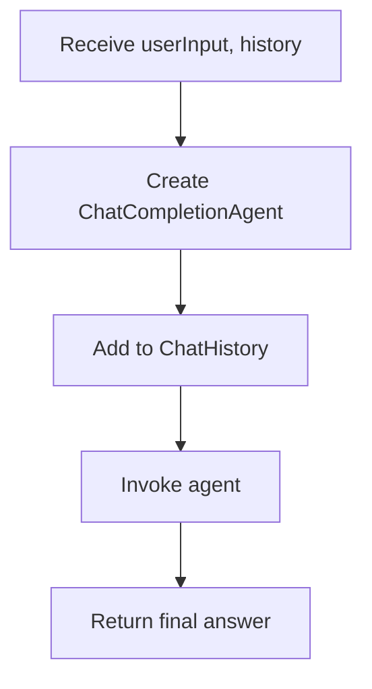
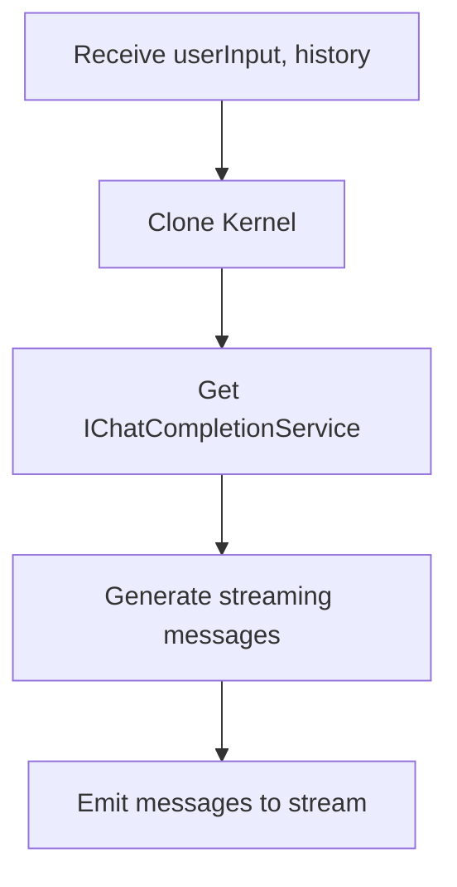
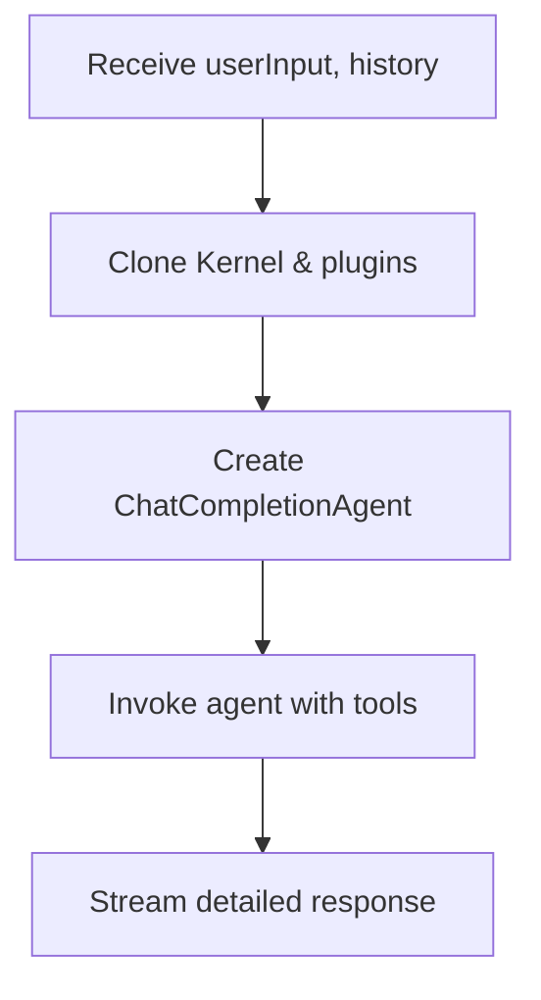
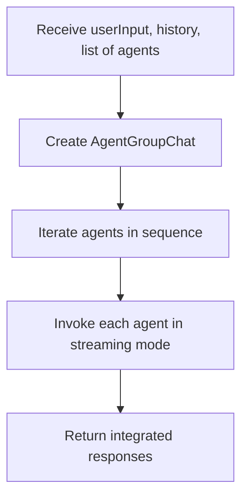
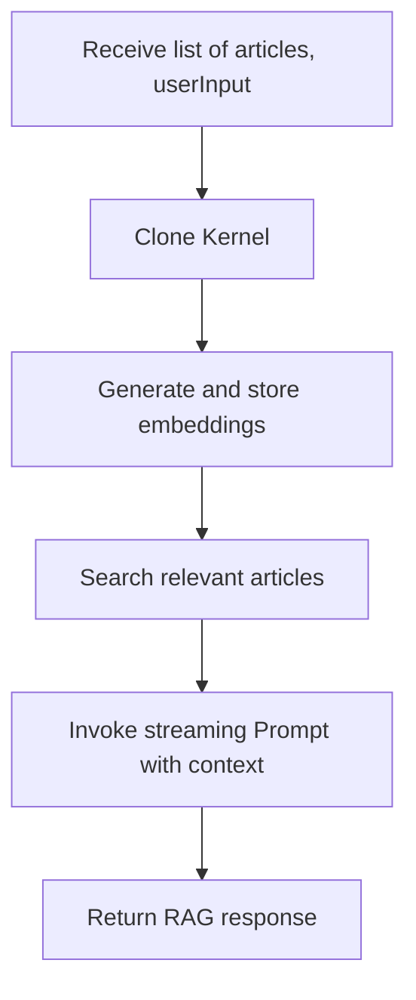
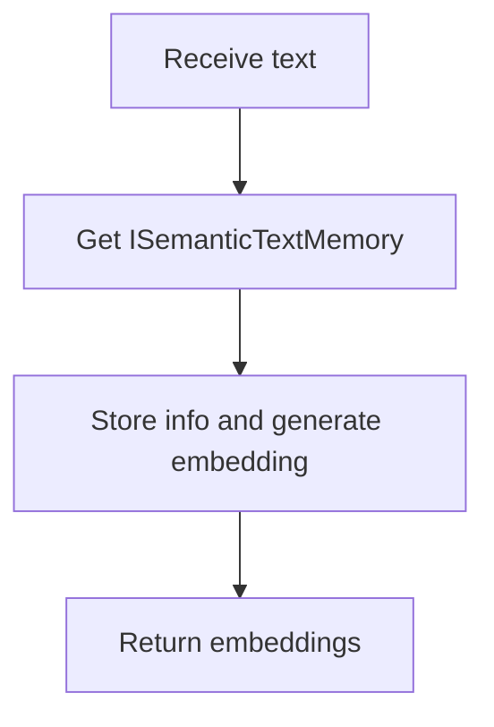
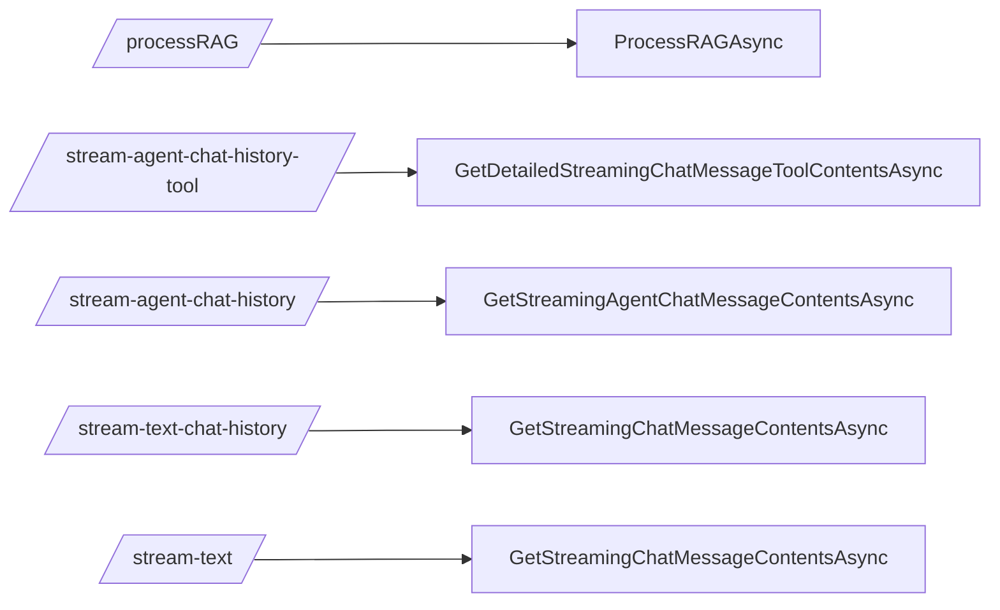

## Configuration and Usage
1. Adjust connection parameters in appsettings.json, for example:
   - OllamaConnectionString for the Ollama service URL.
   - RedisConnection for Redis caching.
   - KernelOptions for setting the model, vector size, etc.

2. Check Program.cs, where the services are injected:
   - builder.AddServiceDefaults() and builder.AddBrainKernel() to initialize the application.
   - KernelService is registered for use in controllers or endpoints.

3. Refer to KernelService.cs for the main assistant logic, handling ChatHistory, agents, and streaming methods.

## Endpoints
1. **POST /processRAG**  
   Processes articles and generates answers using RAG (Retrieval-Augmented Generation).

2. **POST /stream-agent-chat-history-tool**  
   Streams detailed chat content with tools, useful for retrieving additional metadata.

3. **POST /stream-agent-chat-history**  
   Manages multiple agents (Jarvis, CopilotJarvis, etc.) and sends messages progressively.

4. **POST /stream-text-chat-history**  
   Returns streaming chat messages, displaying metadata and content in real time.

5. **POST /stream-text**  
   Sends textual responses continuously, ideal for handling lengthy replies in parts.

## Mermaid Diagrams

### GetChatCompletionResponseAsync

### GetStreamingChatMessageContentsAsync

### GetDetailedStreamingChatMessageToolContentsAsync

### GetStreamingAgentChatMessageContentsAsync

### ProcessRAGAsync

### CreateTextEmbeddingAsync

## Endpoints and Methods Relationship

## Notes about appsettings
- "ConnectionStrings" holds the connection URLs for Ollama, Redis, and Qdrant.
- "KernelOptions" defines the chat and embedding model configuration.
- Adjust these values to target the correct services and tweak AI performance as needed.

## LICENSE

LICENSE

MIT License

Copyright (c) 2025 [Cristhian Fonseca - cfonseca23]

Permission is hereby granted, free of charge, to any person obtaining a copy
of this software and associated documentation files (the "Software"), to deal
in the Software without restriction, including without limitation the rights
to use, copy, modify, merge, publish, distribute, sublicense, and/or sell
copies of the Software, and to permit persons to whom the Software is
furnished to do so, subject to the following conditions:

The above copyright notice and this permission notice shall be included in all
copies or substantial portions of the Software.

THE SOFTWARE IS PROVIDED "AS IS", WITHOUT WARRANTY OF ANY KIND, EXPRESS OR
IMPLIED, INCLUDING BUT NOT LIMITED TO THE WARRANTIES OF MERCHANTABILITY,
FITNESS FOR A PARTICULAR PURPOSE AND NONINFRINGEMENT. IN NO EVENT SHALL THE
AUTHORS OR COPYRIGHT HOLDERS BE LIABLE FOR ANY CLAIM, DAMAGES OR OTHER
LIABILITY, WHETHER IN AN ACTION OF CONTRACT, TORT OR OTHERWISE, ARISING FROM,
OUT OF OR IN CONNECTION WITH THE SOFTWARE OR THE USE OR OTHER DEALINGS IN THE
SOFTWARE.
